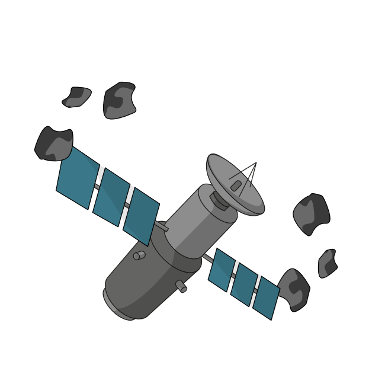
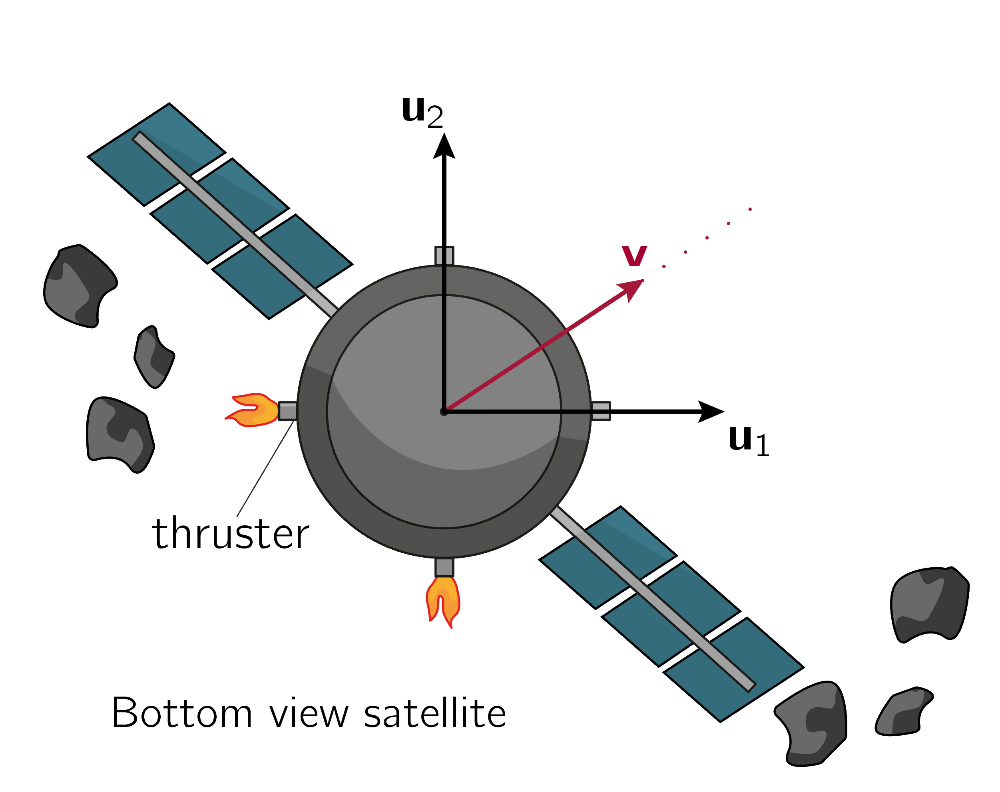

# Are we lost?
## Solution sets and linear independence

_The following can be set as slides in a lecture presentation introducing theorem of linear independence._

A satellite can change its direction with its thrusters. It wants to avoid the space debris. Is the current configuration of thrusters sufficient to avoid a collision?

The satellite wants to avoid the space debris. Thrusters are placed in the $\vec u_1$- and $\vec u_2$-direction.\\
Does the satellite need extra thrusters to move in the direction of $\vec{v}$?

The vector $\vec{v}$ can be written as a linear combination of $\vec{u_1}$ and $\vec{u_2}$. We do not need extra thrusters.\\
The vectors $\vec{u_1}$, $\vec{u_2}$ and $\vec{v}$ are called \underline{linearly dependent}.

