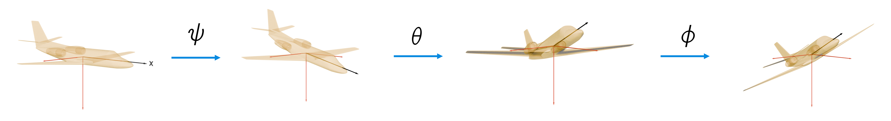
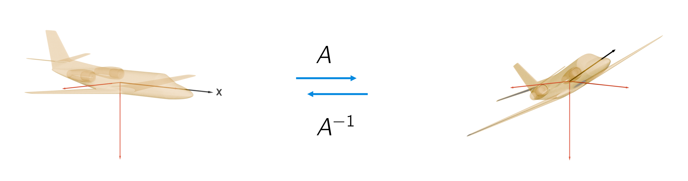

# Looking from a different angle
#### Case on Invertibility of matrices

Let's say that the direction vector of the airplane is $\vec{x} = \begin{bmatrix} x_1 \\ x_2 \\ x_3 \end{bmatrix}$. 
After several maneuvers in the air (rotations) it changed. 

Let $\sigma_1 (\vec{x})$ denote the yaw, $\sigma_2 (\vec{x})$ the pitch and $\sigma_3 (\vec{x})$ the roll, respectively with angles $\psi$, $\theta$, $\phi$. 
For their matrix representations $A_{yaw}(\psi)$, $A_{pitch}(\theta)$ and $A_{roll}(\phi)$, see the slides of lecture 4.

In three dimensions, control systems work with the following rotation matrices:
Roll: \
$R_x(\theta) = \begin{bmatrix}
1 & 0 & 0 \\ 0 & \cos(\theta) & -\sin(\theta) \\
0 & \sin(\theta) & \cos(\theta) \end{bmatrix}$

Pitch: \
$R_y(\theta) = \begin{bmatrix}
\cos(\theta) & 0 & \sin(\theta) \\ 0 & 1 & 0 \\
-\sin(\theta) & 0& \cos(\theta) \end{bmatrix}$

Yaw: \
$R_z(\theta) = \begin{bmatrix}
\cos(\theta) & -\sin(\theta) & 0 \\ \sin(\theta) & \cos(\theta) & 0\\
0 & 0 & 1 \end{bmatrix}$

### Grasple

From the Grasple exercise on Mission LAIKA: Pitch Perfect, remember \\
that the matrix expression for the combination of all rotations, performed in the order yaw, then pitch, and finally roll, is given by: \\
$A = A_{roll}(\phi)A_{pitch}(\theta)A_{yaw}(\psi) = \\$

\begin{array}{ccc}
\cos(\theta)\cos(\psi) & -\cos(\theta)\sin(\psi) & \sin(\theta) \\
\sin(\phi)\sin(\theta)\cos(\psi) + \cos(\phi)\sin(\psi) & -\sin(\phi)\sin(\theta)\sin(\psi) + \cos(\phi)\cos(\psi) & -\sin(\phi)\cos(\theta) \\
-\cos(\phi)\sin(\theta)\cos(\psi) + \sin(\phi)\sin(\psi) & \cos(\phi)\sin(\theta)\sin(\psi) + \sin(\phi)\cos(\psi) & \cos(\phi)\cos(\theta)
\end{array}\right]$

### MC Exercise:
$A = A_{roll}(\phi)A_{pitch}(\theta)A_{yaw}(\psi) \\$

What is $A^{-1}$?

\begin{enumerate}[label=\color{MOOCblue}{\textbf{\Alph*.}}]
-  $A^{-1} = A_{yaw}(\psi)A_{pitch}(\theta)A_{roll}(\phi)$

-  $A^{-1} = A_{roll}(-\phi)A_{pitch}(-\theta)A_{yaw}(-\psi)$

-  $A^{-1} = A_{yaw}(-\psi)A_{pitch}(-\theta)A_{roll}(-\phi)$

-  $A^{-1} = A_{roll}(\phi)A_{pitch}(\theta)A_{yaw}(\psi)$

=> C

