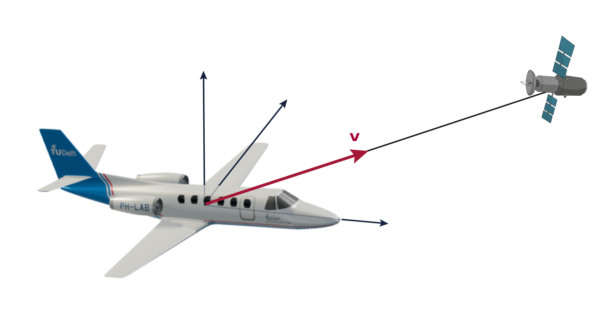
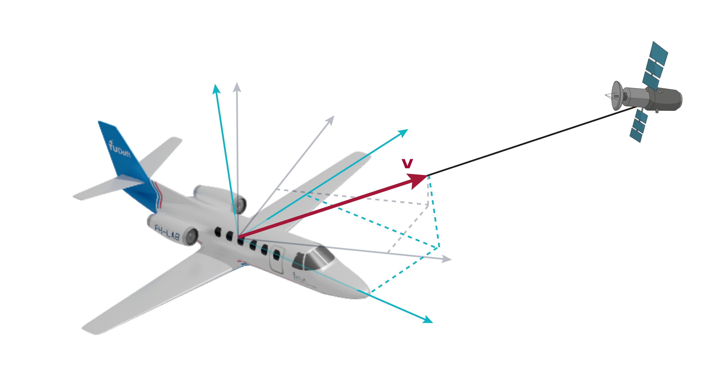
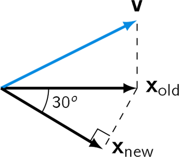

# Coordinates and dimension: Lost connection?
## Mission LAIKA: Lost connection?

To navigate, the Cessna Citation II needs to communicate with the satellite. The vector $\vec v$ points in the direction of the satellite. 

The principal axes of the plane form a basis. The coordinates of $\vec v$ with respect to this basis are equal to $\frac{1}{\sqrt{3}} \begin{bmatrix} 1 & 1 & 1 \end{bmatrix}^T$.

When the plane rotates $-30^o$ around the z-axis, the principal axes of the plane form a new basis. The vector $\vec v $ has different coordinates with respect to this new basis. What are the new coordinates of $\vec v$? 

### MCQ 
#### Q1
When the plane rotates $-30^o$ around the z-axis, the principal axes of the plane form a new basis. The vector $\vec v $ has different coordinates with respect to this new basis. Find the new coordinates of $\vec v$.

$[\mathbf{v}]_{\mathcal{B}_{old}} = \frac{1}{\sqrt{3}} \begin{bmatrix} 1 & 1 & 1 \end{bmatrix}^T$.
What is the new z-coordinate of $\vec v$? 

A) $1$ \
B) $\cfrac{1}{\sqrt{3}}$ \
C) $0$ \
D) $\cfrac{1}{2\sqrt{3}}$ \

=> B

#### Q2
When the plane $-30^o$ around the z-axis, the principal axes of the plane form a new basis. The vector $\vec v $ has different coordinates with respect to this new basis. Find the new coordinates of $\vec v$. 
$[\mathbf{v}]_{\mathcal{B}_{old}} = \frac{1}{\sqrt{3}} \begin{bmatrix} 1 & 1 & 1 \end{bmatrix}^T$.

What is the new x-coordinate of $\vec v$? 

A) $\cfrac{1}{2}+\cfrac{1}{2\sqrt{3}}$ \
B) $\cfrac{\sqrt{3}}{2} + \cfrac{1}{2}$ \
C) $\cfrac{1}{\sqrt{3}}$ \
D) $1$

=> A

#### Q3
When the plane $-30^o$ around the z-axis, the principal axes of the plane form a new basis. The vector $\vec v $ has different coordinates with respect to this new basis. Find the new coordinates of $\vec v$. 

$\vec{v_{old}} = \frac{1}{\sqrt{3}} \begin{bmatrix} 1 & 1 & 1 \end{bmatrix}^T$.

What are the new coordinates of $\vec v$? 
A) $\begin{bmatrix} \frac{1}{\sqrt{3}} & \frac{1}{\sqrt{3}} & \frac{1}{\sqrt{3}} \end{bmatrix}^T$ \
B) $\begin{bmatrix} \frac{1}{2}+\frac{1}{2\sqrt{3}} & \frac{1}{2} - \frac{1}{2\sqrt{3}} & \frac{1}{\sqrt{3}} \end{bmatrix}^T$ \
C) $\begin{bmatrix} \frac{1}{2\sqrt{3}} - \frac{1}{2} & \frac{1}{2} & \frac{1}{2\sqrt{3}} + \frac{1}{2} \end{bmatrix}^T$ \
D) $\begin{bmatrix} -\frac{1}{\sqrt{3}} & -\frac{1}{\sqrt{3}} & -\frac{1}{\sqrt{3}} \end{bmatrix}^T$ \

=> B.

