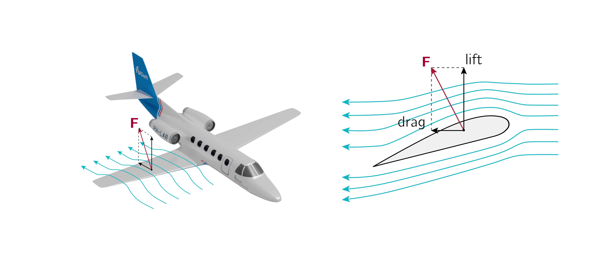

# Orthogonal projections: Forced to fly
## Mission LAIKA: Forced to fly

Air flowing around the wing of an airplane generates an aerodynamic force $\vec F$.

This aerodynamic force can be decomposed in a vertical and a horizontal component. The vertical force is called _lift_. The horizontal component is called _drag_.

## Grasple
